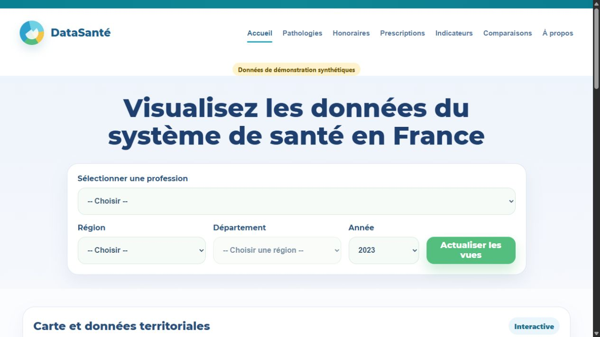
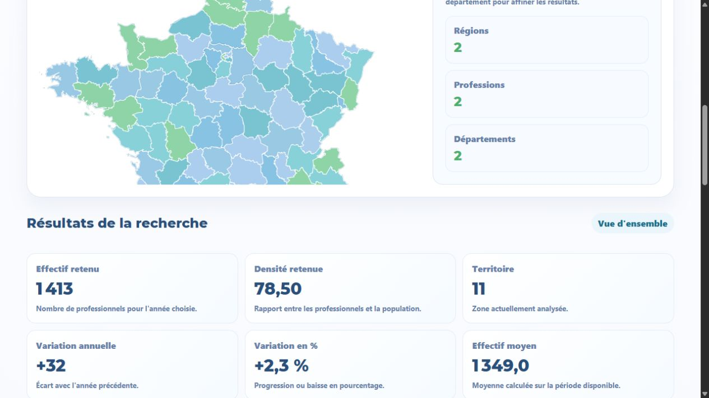
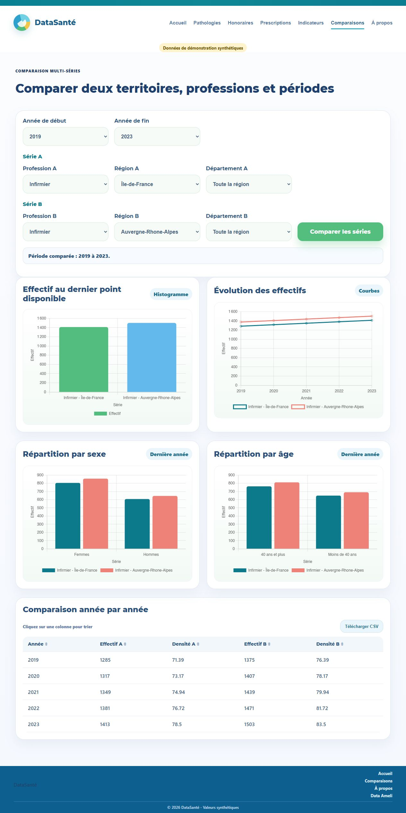
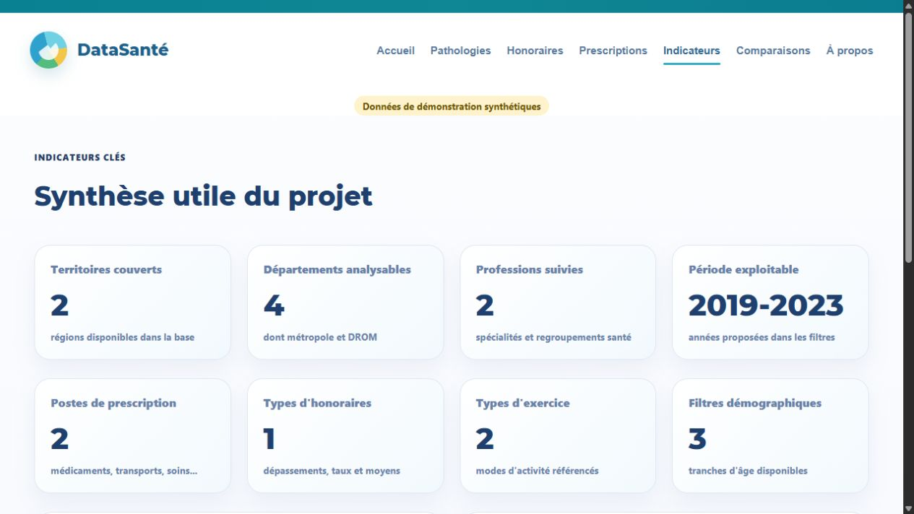
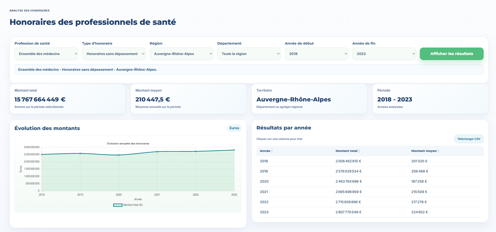

# DataSante

Application Flask d'exploration et de comparaison de donnees de sante en France. Le depot propose une demonstration SQLite reproductible et hors ligne, ainsi qu'un mode reel configurable utilisant l'API Data Ameli.



## Fonctionnalites

- filtres region, departement, profession et periode ;
- effectifs, densites, honoraires, prescriptions et pathologies ;
- comparaisons, graphiques Chart.js, tableaux et carte Leaflet ;
- base de demonstration synthetique generee localement ;
- pipeline ETL Data Ameli pagine, idempotent et teste hors ligne ;
- client Data Ameli conserve pour un usage reel explicite.

## Captures

### Carte interactive



| Comparaisons | Indicateurs |
| --- | --- |
|  |  |



## Demarrage rapide - PowerShell

```powershell
python -m venv .venv
.\.venv\Scripts\Activate.ps1
pip install -r requirements.txt
Copy-Item .env.example .env
python -m scripts.init_demo_db
python -m flask --app app run
```

Linux, macOS ou WSL :

```bash
python -m venv .venv
source .venv/bin/activate
pip install -r requirements.txt
cp .env.example .env
python -m scripts.init_demo_db
python -m flask --app app run
```

La base `data/datasante_demo.db` est ignoree par Git. Toutes ses mesures sont synthetiques et ne sont pas des valeurs Data Ameli.

Pour la recreer :

```powershell
python -m scripts.init_demo_db --force
```

## Mode reel

Definir `APP_MODE=real` et `DATABASE_URL` vers une base SQLAlchemy compatible. Le pipeline issu du travail de donnees SAE 2.04 charge les neuf dimensions sans doublons :

```powershell
python -m etl.pipeline --collect
```

La suppression des tables n'est jamais implicite. Voir [le fonctionnement et les protections du pipeline](docs/data-pipeline.md).

## Tests

```powershell
pip install -r requirements-dev.txt
python -m pytest -v -p no:cacheprovider
```

GitHub Actions execute automatiquement cette suite hors ligne sur chaque push et pull request.

## Auteur

Projet personnel de Yassine Wasel, realise dans le cadre du BUT Informatique. Une autre version de travail en groupe existe separement et n'est pas publiee dans ce depot.

## Donnees et licences

Voir [docs/data-sources.md](docs/data-sources.md). Data Ameli et les contours administratifs sont sous ODbL 1.0. Chart.js est sous MIT et Leaflet sous BSD-2-Clause.

## Licence du code

Le code est publie sous licence [MIT](LICENSE), copyright Yassine Wasel. Les donnees et bibliotheques tierces conservent leurs propres licences.
